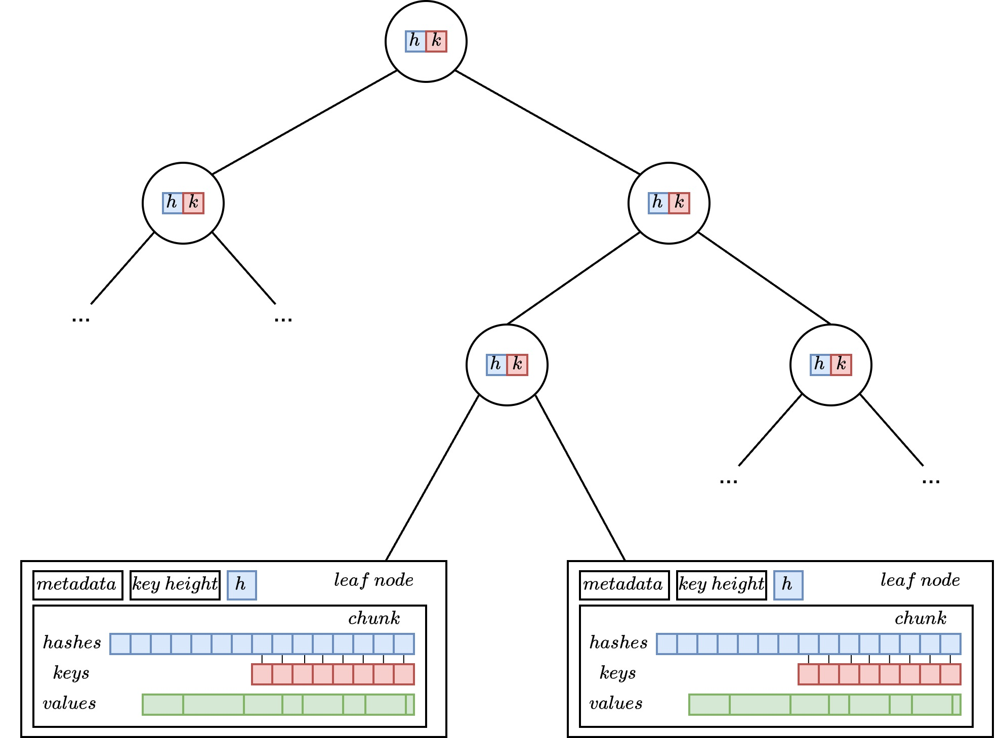

# B+AVL

*B+AVL*

A B+AVL tree is a Merkle search tree that combines the properties of both AVL trees and B+Trees. It is based on Tendermint's IAVL tree.

Properties: 
- Stores Key-Value pairs 
- Inner nodes are binary (like an AVL tree). They contain a copy of the smallest key in their right subtree and the hash value of the left and right subtree (like Tendermint's IAVL tree)
- It is self-balancing (like an AVL and IAVL tree)
- Leaf nodes store chunks of key-value pairs (like a B+Tree) slightly relaxing the AVL balancing property.
- Each chunk contains:
  - A binary tree of hash values in contiguous memory (like a heap). This allows to have binary proofs for individual key-value pairs.
  - Sorted keys of fixed size in contiguous memory.
  - Values of variable size in contiguous memory. Values are not sorted. The keys in the chunk contain metadata to locate the respective values in memory. New values are simply appended at the first free byte. Memory is pre-allocated and reallocated if not sufficient at run-time.
- Provides Merkle proofs of size $\mathcal{O}(log(n))$ for individual key-value pairs
- Provides Merkle proofs of size $\mathcal{O}(log(n))$ for whole chunks (blocks) of data
- It can be reconstructed starting from the leaf nodes only ("leaf blocks"). Inner nodes are never stored and live only in main memory.
- It is efficiently serializable since the chunks in leaf nodes have a flat memory configuration.
- In the presence of Byzantine peers in a peer-to-peer network, it speeds up the time for state synchronization (when a peer needs to receive a valid copy of the tree) since leaves with their chunks can be proven independently, without the need to reconstruct the whole tree before realizing the presence of invalid data. Once all chunks are received, the whole tree is reconstructed, and, assuming each chunk was verified, the whole tree is ensured to be valid. 
- Chunks can be accessed in series for range accesses without a tree traversal. 

#### Searching 

Searching is carried out as in an AVL tree for inner nodes. Once a leaf node is found, the chunk is accessed and a binary search is executed on the sorted keys. When the key is found, the metadata containing the starting position and length of the data is obtained and the value retrieved.

#### Inserting

Inserting is done by locating the chunk that should contain the new key-value pair. If the chunk has space, the key is placed in the array of keys keeping them sorted. The value is appended at the first available byte in the values array. The "heap-like" tree of hash values is updated and the hashes on the path from the leaf node to the root node are updated. If the chunk does not have space, it is split into two halves (like in a B+Tree) and a new inner node connecting the two new halves is created. Hashes are then updated up to the root node. If the inner nodes do not follow the AVL properties, the tree is rebalanced with rotations. 

#### Getting proofs

Proofs are obtained as per a normal binary tree. The hash values of sibling nodes are appended in the proof while the tree is traversed. Proofs for individual key-value pairs need to traverse the "heap-like" tree of hashes contained in the chunk using the property:

$$
child(i)= \begin{cases}
{2i+1} \text{ (left)}\\
2i+2 \text{ (right)}
 \end{cases} 
 \rightarrow  parent(i)=\lfloor(i − 1) / 2\rfloor
$$ 